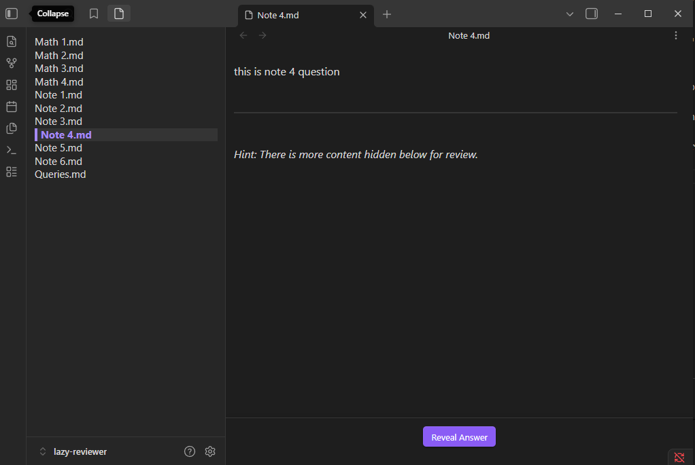
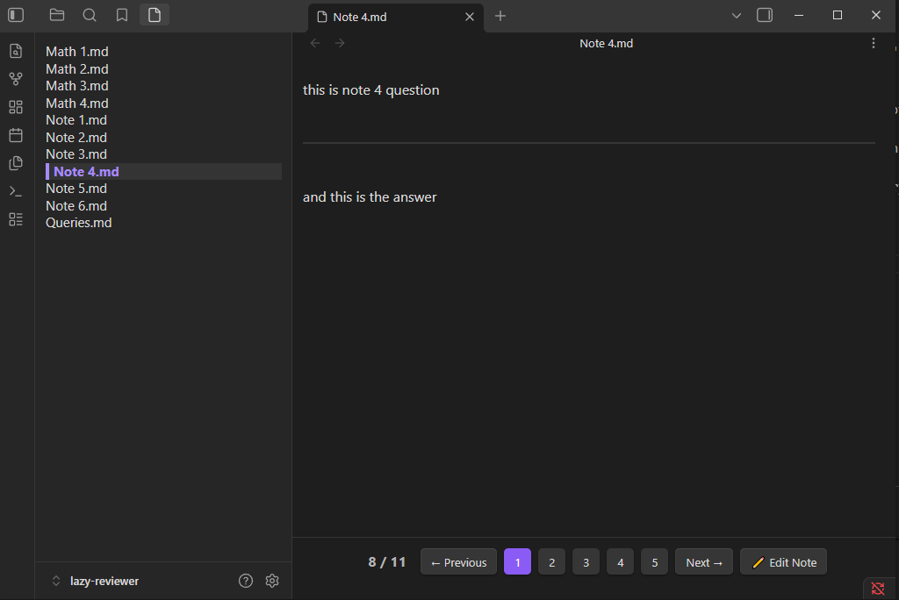

# Lazy Reviewer

A plugin that I did for myself with the massive help of AI.
Because of that the source is still a mess, and I plan to rewrite it from scratch in the future.

To try the plugin, simply download the files "main.js" and "manifest.json" from GitHub, and put them inside [your_vault]\.obsidian\plugins\lazy-reviewer\

I hope someone with good coding skills will like the idea of this plugin and will adopt it.

The plugin needs DATAVIEW.
It can get DATAVIEW queries through a custom command (CTRL+P > Lazy Reviewer: Dataview Query).
The query result is shown as a list of clickable notes on the left panel.
The actual opened note will be highlighed in the list.
There is a panel on the bottom with "previous" and "next" buttons, which allows the user to navigate the notes on the list.
There are also two custom commands for the same purpose.
If the note contains the string %%??%%, anything after the string will be hidden.
If there's something hidden in the present note, the bottom panel will have a "show" button; if clicked, the hidden section will be revealed.
There's also a custom command which does the same thing.
If there's nothing hidden in the present note, the bottom panel will have a variable number of buttons; the number can be customized in the setting (requires a reload of the plugin before it takes effect).
These buttons allow the user to grade their knowledge of the note.
The value of the knowledge level will be saved in a property in the frontmatter, which defaults to "lazy_reviewer_grade" (can be modified in the settings).

The notes are opened in a custom leaf, in order for the plugin to manipulate the notes content (hide a portion of the note) before rendering, without any need to modify the note's file itself.
Because of this, the notes won't be directly editable inside the main view, but the bottom panel has an "edit" button which will open a new tab where the user will be able to edit the note.
When the user opens a new note in the reviewer, it gets opened on the same custom tab, instead of opening a new tab every time the use opens a new note.

## Examples of some queries

- LIST WITHOUT ID file.name

- LIST WITHOUT ID file.name FROM "folder name"

- LIST WITHOUT ID file.name FROM #tag

- LIST WITHOUT ID file.name FROM "folder name" AND (#tag/subtag1 OR #tag/subtag2)

- LIST WITHOUT ID file.name WHERE property_name = "property_value"

- LIST WITHOUT ID file.name WHERE file.mtime >= date(today) - dur(1 week)

- LIST WITHOUT ID file.name SORT file.ctime ASC

- LIST WITHOUT ID file.name LIMIT 100

- LIST WITHOUT ID file.name FROM [[Target Note]] //all files which links to target note

- LIST WITHOUT ID file.name FROM outgoing([[Target Note]]) //all links contained in target note

- LIST WITHOUT ID file.name WHERE contains(file.outlinks, [[Target Note]]) //same but as a filter

- LIST WITHOUT ID link(file.link, dateformat(file.ctime, "yyyy-MM-dd")) //custom links names, for example creation date, instead than the note's name (useful if the note's title would give away the answer during review)